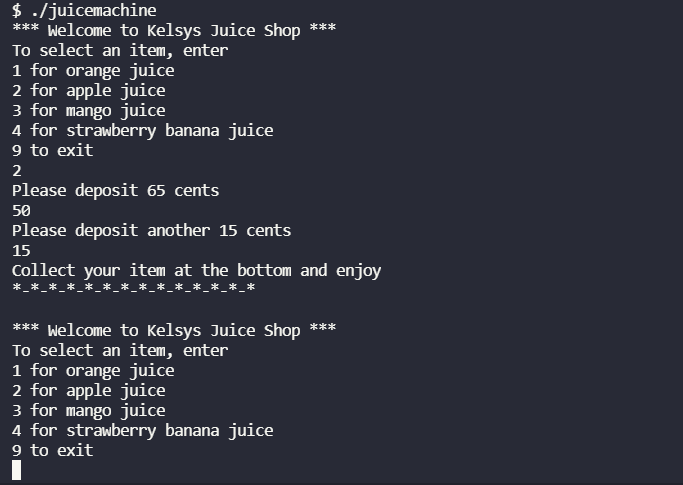

# Juice-Machine
A C++ CLI Juice Vending Machine

The program does the following;
1. Show the customer the different product sold by the juice machine.
2. Let the customer make the selection.
3. Show the customer the item selected.
4. Accept money from customer.
5. Release the item.
Input – the selected item, quantity
Output – the selected item and customer receipt.

## Screenshots

